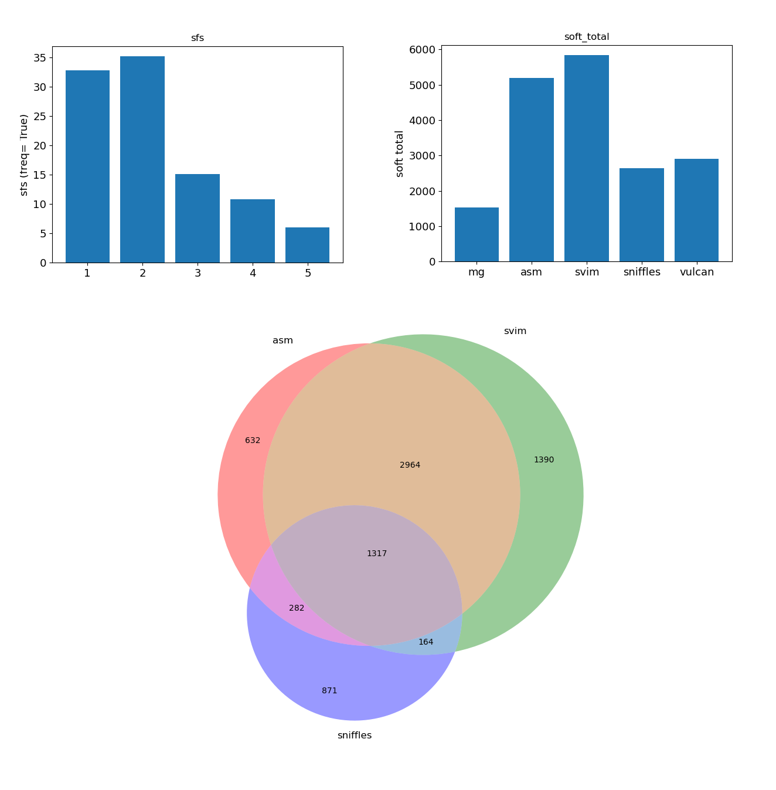

# Merge PAV calls

scripts to study overlap between pairwise PAVs called by independent software.

Calculates overlap for insertions / deletions independently. 

Requires the following input from each software:
	- chrom ;
	- start ; 
	- end ; 
	- length ;

length should be the length of the PAV, i.e. the maximum length across query and reference. 

## Deployment.

Use the script **merge_single.sh**, it collects the input bed files from several software, passes them to merge_bed.py for actual merging. 

### merge_asmmg.sh

> wrapper scripts for merge_bed.py

**input preparation**

PAV caller output to merge is selected. 

i. In the current application, the output from the software minigraph is read from list (file : *names_oreder.txt*).
	- IDs correspond to genome ID.
	- order in list corresponds to existing digit identifier (Yong, genomes 2through 16).
 
ii. file basename and counter are used to used select output from other software for the same accession.  

iii. files and names are passed to merge_bed.py (see below).

## merge_bed.py

This script manages the actual merging. 

### INPUT 
--bedlist : comma separated list of bed inputs, full path ; 
--names : names of the software in the final output.
--dist : minimum distance for merging, in bp. 
--pavl : minimum pav length for mummer validation.: 
-o : 	output directory
--mummer : [optional] nucmer file of reference / query alignment. If given, searches for each PAV in nucmer alignment, assuming same chromosome, extracts query sequence coordinates. 

## OUTPUT 
- _sfs_bar.png : bar plot of frequency of PAVs across callers. 
- _soft_total_bar.png : bar plot of total number of PAVs called by each software. 
- _soft_unique_bar.png : bar plot of percentge of unique PAVs for each caller (relative to software PAV calls) ; 
- _unique_bar.png : dissection of unique PAV calls across PAVs. 
- summary_[soft_names]_d[dist].tsv : barplot information. 
- _summary_mg-asm_d15.tsv

- INS_[soft_names]_d[dist].merged.bed : merged insertions only ; 
- DEL_[soft_names]_d[dist].merged.bed : merged deletions only ; 
- merged_[soft_names]_d[dist].merged.bed : merged deletions and insertions. 

If 3 or more software are merged, merge_bed.py outputs venn diagrams of shared PAVs for every possible 3-way software combination. 

Example summary:

- 1. Variant frequency across software.

- 2. Total calls per software. 

- 3. Example 3-way venn diagram. 

